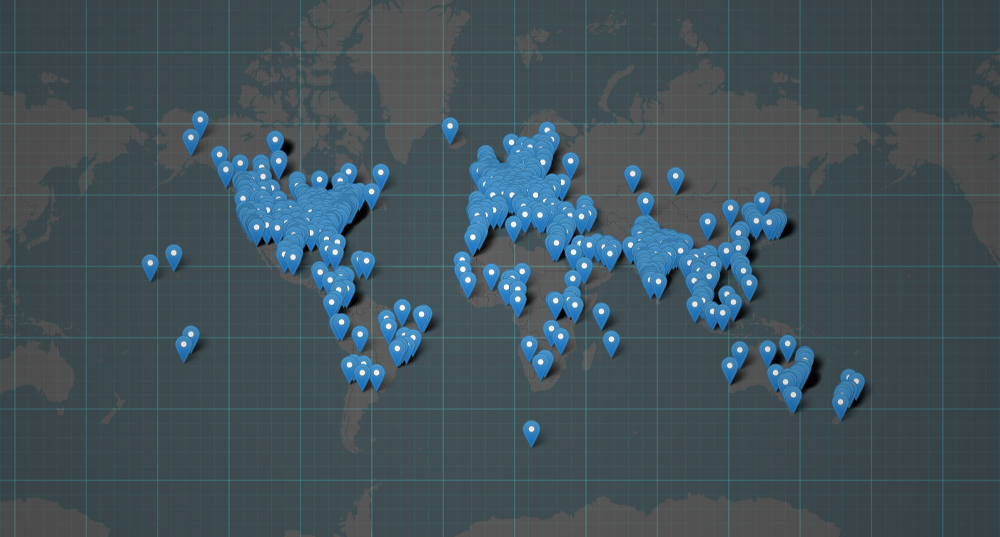

# community-map



Using some scraping tech and map finding stuff later i am able to get hackclubbers locations ish from PUBLIC DATA!

### Install deps

```bash
bun install
```

To run:

```bash
bun run index.ts
```

This project was created using `bun init` in bun v1.2.21. [Bun](https://bun.com) is a fast all-in-one JavaScript runtime.
